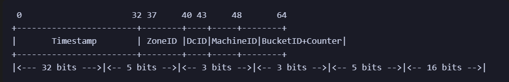

# GenID
64位分布式全局唯一ID生成服务，采用类似雪花算法(snowflake)

## 特性
2. 独立的TCP服务，协议简单，和编程语言无关
2. 运维部署简单，维护成本低
2. 支持一次获取单个ID 或者多个ID
2. 高性能，32路令牌桶，支持百万连接，每秒最多生成 40亿个ID
2. 使用长连接，固定分配令牌桶，极大概率保证了客户端获取id单调递增，优化数据库存储性能

## 64位ID说明



- Timestamp（时间戳）: 高32位，表示当前时间戳，精确到秒
- ZoneID（区域ID）: 5位，表示区域ID，全球可以划分32个区域
- DcID（数据中心ID）: 3位，表示数据中心ID，每个区域支持8个数据中心
- MachineID（机器ID）: 3位，表示机器ID，每个数据中心最多可以部署8个GenID节点
- BucketID+Counter（桶ID+计数器）: 5位桶ID+16位计数器，令牌桶用于提高并发度，计时器用于在单个桶上生成唯一ID

ID高32位采用时间戳，有利于排查问题，`id<<32` 即可得到ID生成的时间

## 部署
1. 编译

```
go build -o genid main.go
```

2. 运行

```
nohup genid -config config.json  >>run.log 2>&1  &
```

## 客户端使用
下面是一个python client

```python

import socket
import struct

class IDGeneratorClient:
    def __init__(self, host, port):
        self.host = host
        self.port = port
        self.sock = socket.socket(socket.AF_INET, socket.SOCK_STREAM)
        self.sock.connect((self.host, self.port))

    def get_id(self):
        # CMD=0表示获取一个ID
        self.sock.sendall(struct.pack('BB', 0, 0))
        data = self.sock.recv(8)
        return struct.unpack('>Q', data)[0]

    def get_ids(self, count):
        # CMD=1表示获取多个ID，Count表示需要获取的ID数量
        self.sock.sendall(struct.pack('BB', 1, count))
        head = self.sock.recv(1)
        num = struct.unpack(">B",head)[0]
        
        data=b''
        target_len = 8 * num
        while True:
            data += self.sock.recv(target_len)
            if len(data) >= target_len:
                ids = struct.unpack('>'+'Q' * num, data)
                return ids

    def close(self):
        self.sock.close()
        
if __name__ == "__main__":
    client = IDGeneratorClient('localhost', 3778)

    for i in range(100):
        ids = client.get_ids(20)
        print(ids)

    client.close()

```


## 高可用
支持两种方式
1. 客户端程序传入一组GenID服务地址，由客户端做故障转移,失败重连
2. 服务端做负载均衡，把GenID部署在nginx/haproxy 等4层代理之后


## 扩展
为了提高系统可靠性，下面的特性还需要实现

1. 程序启动的时候，互相检查同一个DC中各个GenID节点配置准确性，防止数据污染
2. 定时把时间戳写盘，当节点从硬件故障中恢复的时候，可以对比服务器时间和存储的时间戳，避免产生回拨


## Power by AI

GenID是基于GPT-4生成，AI完成了90%以上工作

### server端 提示词

你是一个软件工程师，需要开发一个分布式全局唯一ID生成服务，需要按照下面的技术方案进行编写程序

1.使用golang语言，程序是一个个tcp server，ID生成算法参考雪花算法
2.生成的ID是64位无符号整数，其组成如下：高32位是当前时间戳，5位zone_ID，3位Dc_ID，3位机器 id，5位bucket id+16位 计数值

程序配置

配置文件是json格式，通过glag指定配置文件路径
配置文件至少有4项： 端口号，zone ID， DC ID，机器 ID
3.程序启动的时候，要对配置项进行校验，zone ID 不能大于32，dc ID 不能大于8，机器 ID不能大于8


接口定义

1.数据传输基于tcp 服务
1.对外提供2个接口，客户端请求定义如下

type Request struct {
CMD uint8
Count uint8
}

1.接口1，CMD=0，表示 获取一个ID，返回给客户端一个int 64的唯一ID
2.接口2，CMD=1，表示获取多个ID，Count 表示具体需要获取的ID数量，服务器返回的时候，先返回Count，然后依次返回Count个64位ID

主逻辑

为了提高程序并发度，程序初始化的时候需要创建 32个Bucket
2.每个Bucket，包括如下字段： 当前时间戳，zone id,dc id, 机器id，计数器，读写锁
3.Bucket有2个方法，
获取一个ID
获取N个ID，获取ID的方法要加锁，获取ID之后，计时器要加1
4.一个客户端连接创建成功之后，会随机分配一个Bucket，这客户端所有请求 都会从这个Bucket 获取
程序里面有一个每1秒执行一次的定时任务，逻辑是把所有的bucket中的时间戳刷新位当前时间戳

### client端代码

用python为这个生成服务开发一个sdk，按照下面的技术方案编写程序

1.使用长连接
2.提供两个方法：1.获取单个ID，2.获取多个ID